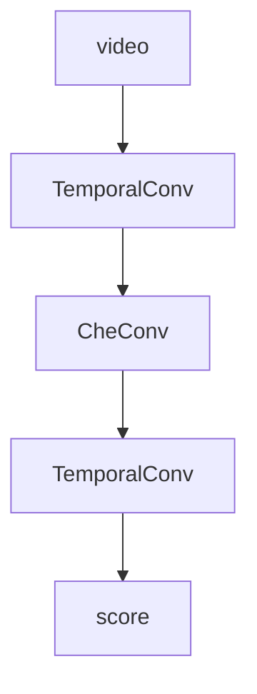

# STConv

```mermaid
flowchart TD
    A[video] --> B[TemporalConv]
    B --> C[CheConv]
    C --> D[TemporalConv]
    D --> E[score]
```

    
---

# STAttention
---

# STGCNMultiTask

1. Predictive classification
   feature fusion
    > 8 angle
    > 64 characteristic
   
   first attention
3. mark
   second attention
