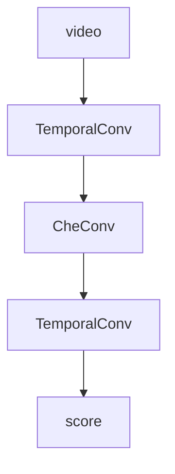

# dateload
- timecode to frame
- calculate frame sampling in video
     * max time steps
     * frame count
- data process
    * enhancement
    * normalization
    * filling
- clarify
  > cross entropy loss
- mark
  > MSE loss
---

# STConv

    
---

# STAttention
---

# STGCNMultiTask

1. Predictive classification
   first attention
   feature fusion
   > 8 angle
   > 64 characteristic
3. mark
   second attention
   sigmoid
